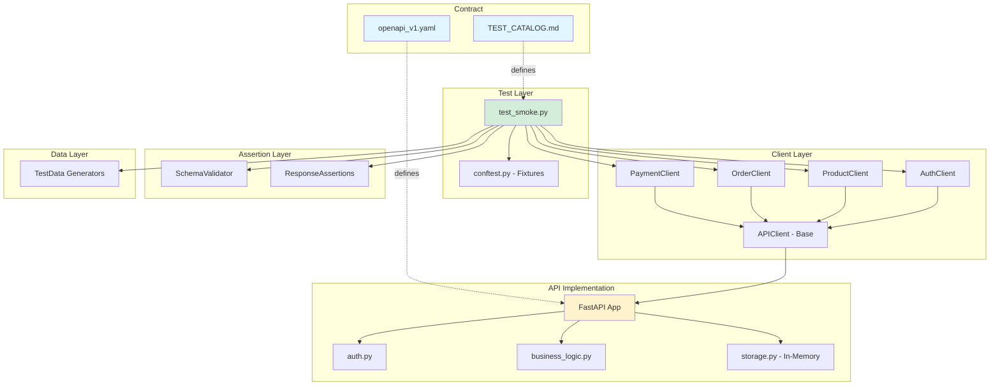

# YMH429 SQA API Test Automation Framework

[](https://github.com/recepztrk/ymh429-sqa-api-test-framework/actions/workflows/ci.yml)

**Reusable API test automation framework for e-commerce Order & Payment REST API**

## Overview

This project implements a complete API test automation framework for an e-commerce platform, following industry best practices for API testing. The framework is built using pytest and includes a FastAPI implementation that serves as the system under test.

### Key Features

- ✅ **OpenAPI-First Design**: Implementation strictly follows `openapi_v1.yaml` specification
- ✅ **Layered Architecture**: Clean separation between API clients, assertions, and test data
- ✅ **Comprehensive Logging**: Automatic request/response logging for debugging
- ✅ **CI/CD Integration**: GitHub Actions workflow with automated smoke tests
- ✅ **Business Rules Validation**: Cart limits, stock management, order state transitions
- ✅ **Deterministic Tests**: Runs reliably both locally and in CI

## Architecture



## Project Structure

```
.
├── .github/workflows/
│   └── ci.yml                 # CI/CD workflow
├── api/                       # API implementation (SUT)
│   ├── main.py               # FastAPI app with routes
│   ├── models.py             # Pydantic models (OpenAPI schemas)
│   ├── auth.py               # JWT authentication
│   ├── business_logic.py     # Business rules validation
│   └── storage.py            # In-memory thread-safe storage
├── tests/                     # Test framework
│   ├── conftest.py           # Pytest fixtures
│   ├── test_smoke.py         # SMK-01 E2E smoke test
│   ├── clients/              # API client abstraction
│   ├── assertions/           # Validation helpers
│   └── data/                 # Test data generators
├── docs/evidence/            # Test execution evidence
├── openapi_v1.yaml           # API contract (source of truth)
├── TEST_CATALOG.md           # Test scenarios (source of truth)
├── requirements.txt          # Python dependencies
└── pytest.ini                # Pytest configuration
```

## Quick Start

### Prerequisites

- Python 3.11+
- pip
- Git

### Installation

```bash
# Clone repository
git clone https://github.com/recepztrk/ymh429-sqa-api-test-framework.git
cd ymh429-sqa-api-test-framework

# Create virtual environment
python3 -m venv venv
source venv/bin/activate  # On Windows: venv\Scripts\activate

# Install dependencies
pip install --upgrade pip
pip install -r requirements.txt
```

### Running Locally

**Terminal 1: Start API**
```bash
source venv/bin/activate
python -m uvicorn api.main:app --host 127.0.0.1 --port 8000
```

**Terminal 2: Run Tests**
```bash
source venv/bin/activate

# Run smoke tests
pytest -m smoke -v

# Run all tests
pytest -v

# Generate HTML report
pytest -m smoke --html=report.html
```

### API Endpoints

| Endpoint | Method | Auth | Description |
|----------|--------|------|-------------|
| `/health` | GET | No | Health check |
| `/auth/register` | POST | No | Register user |
| `/auth/login` | POST | No | Login (get JWT) |
| `/products` | GET | No | List active products |
| `/products/{id}` | GET | No | Get product |
| `/products` | POST | Admin | Create product |
| `/orders` | POST | Customer | Create order |
| `/orders/{id}` | GET | Auth | Get order |
| `/orders/{id}/cancel` | POST | Customer | Cancel order |
| `/payments` | POST | Auth | Create payment |
| `/payments/{id}` | GET | Auth | Get payment |

### Business Rules

- **Cart Total**: min 50 TRY, max 5000 TRY
- **Item Quantity**: 1-10 per item
- **Stock Management**: Atomic operations with rollback
- **Order States**: CREATED → PAID or CANCELLED
- **Payment Rules**: Only CREATED orders can be paid

## Test Coverage

### SMK-01: End-to-End Smoke Test

Complete purchase flow validation:
1. Register new customer
2. Login and get JWT token
3. List available products
4. Create order with valid items
5. Create payment for order
6. Verify order status changed to PAID

**Execution Time**: ~0.5s  
**Status**: ✅ PASSING

See: [`tests/test_smoke.py`](tests/test_smoke.py)

## CI/CD Pipeline

GitHub Actions workflow runs on every push/PR:

1. ✅ Setup Python 3.11
2. ✅ Install dependencies with pip cache
3. ✅ Start API server (uvicorn)
4. ✅ Wait for `/health` endpoint
5. ✅ Run smoke tests with pytest
6. ✅ Upload JUnit XML results

See: [`.github/workflows/ci.yml`](.github/workflows/ci.yml)

## Evidence & Reports

Test execution evidence is collected in `docs/evidence/`:
- Test output logs
- Request/response samples
- CI pipeline screenshots

## Configuration

### Environment Variables

- `BASE_URL`: API base URL (default: `http://127.0.0.1:8000`)

### pytest Markers

- `@pytest.mark.smoke`: Critical path smoke tests
- `@pytest.mark.auth`: Authentication tests
- `@pytest.mark.products`: Product tests
- `@pytest.mark.orders`: Order tests
- `@pytest.mark.payments`: Payment tests

## Development

### Adding New Tests

1. Follow the pattern in `tests/test_smoke.py`
2. Use existing clients from `tests/clients/`
3. Use assertion helpers from `tests/assertions/`
4. Add test ID from `TEST_CATALOG.md`
5. Add appropriate pytest marker

Example:
```python
import pytest
from tests.clients.product_client import ProductClient

@pytest.mark.products
def test_prod_01_list_products(product_client):
    """Test ID: PROD-01 - List products without auth"""
    response = product_client.list_products()
    assert response.status_code == 200
    products = response.json()
    assert isinstance(products, list)
```

### Code Quality

- All API behavior follows `openapi_v1.yaml`
- No scope creep - stay within contract boundaries
- Deterministic tests - no flaky tests allowed
- Clean separation of concerns

## Troubleshooting

**API won't start:**
```bash
# Check port availability
lsof -i :8000

# Use different port
python -m uvicorn api.main:app --port 8001
```

**Tests failing with connection error:**
```bash
# Check BASE_URL matches running API
export BASE_URL=http://127.0.0.1:8000
pytest -m smoke -v
```

**IPv6 localhost issues:**
- Always use `127.0.0.1` instead of `localhost`
- CI configured to use `127.0.0.1` explicitly

## Contributing

1. Create feature branch from `main`
2. Make changes following existing patterns
3. Run tests locally: `pytest -v`
4. Push and create PR
5. CI must pass before merge

## License

Educational project for YMH429 Software Quality Assurance course.

## Contact

**Student**: Recep Öztürk (22290380)  
**Course**: YMH429 - Software Quality Assurance  
**Repository**: https://github.com/recepztrk/ymh429-sqa-api-test-framework
