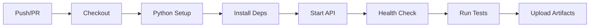

# 🛒 YMH429 – SQA API Test Automation Framework

> **E-Ticaret Sipariş & Ödeme API Test Otomasyon Çatısı**  
> FastAPI + pytest + GitHub Actions CI/CD


---

## 📋 İçindekiler

- [Proje Özeti](#-proje-özeti)
- [Hızlı Başlangıç](#-hızlı-başlangıç)
- [Mimari ve Dizin Yapısı](#️-mimari-ve-dizin-yapısı)
- [API Sözleşmesi (OpenAPI)](#-api-sözleşmesi-openapi)
- [İş Kuralları](#-iş-kuralları)
- [Test Stratejisi](#-test-stratejisi)
- [Kurulum](#-kurulum)
- [API'yi Çalıştırma](#-apiyi-çalıştırma)
- [Testleri Çalıştırma](#-testleri-çalıştırma)
- [CI/CD Pipeline](#-cicd-pipeline)
- [Hata Modeli](#-hata-modeli-errorresponse)
- [Troubleshooting](#-troubleshooting)
- [Raporlama ve Kanıtlar](#-raporlama-ve-kanıtlar)
- [Teslim İçeriği](#-teslim-içeriği)

---

## 🎯 Proje Özeti

Bu repository, **YMH429 Yazılım Kalite Güvencesi ve Testi** dersi kapsamında geliştirilmiş proje teslimidir.

### Problem

Modern uygulamalarda kritik işlevler (ürün yönetimi, sipariş, ödeme) çoğunlukla REST servisleri üzerinden sağlanır. Bu servislerin hatalı çalışması doğrudan kullanıcı deneyimi ve iş sürekliliğini etkiler.

### Çözüm

- ✅ **Kritik akışların otomatik doğrulanması**
- ✅ **Negatif ve sınır değer senaryolarının test edilmesi**
- ✅ **CI üzerinde otomatik test koşturulması**

### Kapsam

E-ticaret alanında tipik bir akış modellenmiştir:

```
Register → Login → Products → Order → Payment
```

### Repository Bileşenleri

| Bileşen | Açıklama |
|---------|----------|
| **SUT** | Test edilen örnek REST API (FastAPI) |
| **Test Framework** | pytest tabanlı modüler otomasyon çatısı |
| **CI/CD** | GitHub Actions entegrasyonu |

> ⚠️ **Not:** Odak "API yazmak" değil; **API'yi sistematik biçimde test etmek** ve **testlerin CI üzerinde otomatik çalıştığını kanıtlamak**tır.

---

## 🚀 Hızlı Başlangıç

```bash
# 1. Bağımlılıkları yükle
pip install -r requirements.txt

# 2. API'yi başlat
uvicorn api.main:app --host 127.0.0.1 --port 8000

# 3. Testleri çalıştır (yeni terminal)
pytest -v
```

---

## 🏗️ Mimari ve Dizin Yapısı

```
.
├── api/                           # SUT: FastAPI uygulaması
│   ├── main.py                    # Route'lar + error handling + middleware
│   ├── models.py                  # Pydantic request/response modelleri
│   ├── auth.py                    # JWT, kullanıcı/rol yönetimi
│   ├── business_logic.py          # Sepet/stock/order/payment kuralları
│   └── storage.py                 # In-memory storage (demo amaçlı)
│
├── tests/                         # Test Otomasyon Çatısı
│   ├── clients/                   # HTTP client katmanı
│   │   ├── api_client.py          # Base API client
│   │   ├── auth_client.py         # Auth endpoint client
│   │   ├── product_client.py      # Product endpoint client
│   │   ├── order_client.py        # Order endpoint client
│   │   └── payment_client.py      # Payment endpoint client
│   │
│   ├── assertions/                # Ortak doğrulama fonksiyonları
│   │   ├── response_assertions.py # Status code, field doğrulama
│   │   └── schema_validator.py    # JSON schema validasyonu
│   │
│   ├── data/                      # Test verisi yardımcıları
│   │   └── test_data.py           # Valid product/qty seçimi vb.
│   │
│   ├── conftest.py                # pytest fixture'ları
│   ├── test_health.py             # Health check testleri
│   ├── test_auth.py               # Authentication testleri
│   ├── test_products.py           # Product testleri
│   ├── test_orders.py             # Order testleri (boundary/negatif)
│   ├── test_payments.py           # Payment testleri + yetkilendirme
│   └── test_smoke.py              # SMK-01: Uçtan uca kritik akış
│
├── docs/                          # Dokümantasyon & Kanıtlar
│   ├── FINAL_REPORT.md            # Final rapor
│   ├── evidence/                  # Test çıktıları, ekran görüntüleri
│   ├── planning/                  # Test planları, kataloglar
│   └── spec/                      # API spesifikasyonları
│
├── .github/workflows/ci.yml       # GitHub Actions CI pipeline
├── openapi_v1.yaml                # OpenAPI 3.0 sözleşmesi
├── requirements.txt               # Python bağımlılıkları
└── pytest.ini                     # pytest konfigürasyonu
```

---

## 📄 API Sözleşmesi (OpenAPI)

Repository'deki `openapi_v1.yaml`, API'nin **sözleşmesi (contract)** olarak kabul edilir.

### Endpoint Özeti

| Grup | Endpoint | Açıklama |
|------|----------|----------|
| **Health** | `GET /health` | Sağlık kontrolü |
| **Auth** | `POST /auth/register` | Kullanıcı kaydı |
| | `POST /auth/login` | Giriş (JWT token) |
| **Products** | `GET /products` | Ürün listesi |
| | `GET /products/{id}` | Ürün detayı |
| | `POST /products` | Ürün oluştur *(admin)* |
| **Orders** | `POST /orders` | Sipariş oluştur |
| | `GET /orders/{id}` | Sipariş detayı |
| | `POST /orders/{id}/cancel` | Sipariş iptali |
| **Payments** | `POST /payments` | Ödeme oluştur |
| | `GET /payments/{id}` | Ödeme detayı |

> 📌 **Contract Drift**: OpenAPI ile implementasyonun farklılaşması kabul edilmez. Sözleşme değişirse uygulama ve testler birlikte güncellenir.

---

## 📊 İş Kuralları

İş kuralları `api/business_logic.py` içerisinde uygulanır:

| Kural | Değer | Açıklama |
|-------|-------|----------|
| **Minimum Sepet** | 50 TRY | Sepet toplamı en az 50 TRY |
| **Maksimum Sepet** | 5000 TRY | Sepet toplamı en fazla 5000 TRY |
| **Ürün Miktarı** | 1-10 | Her üründen min 1, max 10 adet |
| **Stok Kontrolü** | ✓ | Yetersiz stokta sipariş reddedilir |
| **Ödeme Durumu** | PAID | Başarılı ödemede sipariş PAID olur |
| **Yetkilendirme** | JWT | Token olmadan veya yanlış rol ile erişim engellenir |

---

## 🧪 Test Stratejisi

### Test Tasarım Teknikleri

- **Eşdeğer Bölgeleme (Equivalence Partitioning)**
- **Sınır Değer Analizi** (min 50 / max 5000, qty 1-10)
- **Negatif Testler** (yetkisiz erişim, hatalı kimlik, olmayan kaynak)

### Test Marker'ları

```ini
markers =
    smoke    : Smoke tests (uçtan uca kritik yol)
    health   : Health check testleri
    auth     : Authentication testleri
    products : Product testleri
    orders   : Order testleri
    payments : Payment testleri
```

### Test Katmanları

| Katman | Dosya | Amaç |
|--------|-------|------|
| **Client** | `tests/clients/` | HTTP isteklerini standartlaştırma |
| **Assertion** | `tests/assertions/` | Status code, alan, schema doğrulama |
| **Data** | `tests/data/` | Test verisi yardımcıları |
| **Tests** | `tests/test_*.py` | Test senaryoları |

---

## 💻 Kurulum

### Gereksinimler

- Python 3.11+ (CI uyumluluğu için önerilen)
- pip, venv

### Kurulum Adımları

```bash
# 1. Virtual environment oluştur
python -m venv venv

# 2. Aktive et
# macOS/Linux:
source venv/bin/activate
# Windows:
.\venv\Scripts\activate

# 3. Bağımlılıkları yükle
pip install -r requirements.txt
```

---

## 🖥️ API'yi Çalıştırma

```bash
uvicorn api.main:app --host 127.0.0.1 --port 8000
```

### Dokümantasyon URL'leri

| URL | Açıklama |
|-----|----------|
| http://127.0.0.1:8000/docs | Swagger UI |
| http://127.0.0.1:8000/redoc | ReDoc |
| http://127.0.0.1:8000/openapi.json | OpenAPI JSON |

---

## ▶️ Testleri Çalıştırma

> ⚠️ **Önemli:** Testleri çalıştırmadan önce API'nin ayakta olması gerekir.

```bash
# Tüm testler
pytest -v

# Smoke test (kritik uçtan uca)
pytest -m smoke -v

# Belirli modül testleri
pytest -m auth -v
pytest -m orders -v

# Detaylı çıktı
pytest -vv

# HTML rapor (lokal)
pytest -v --html=pytest-report.html --self-contained-html

# Kanıt için tam çıktı dosyası
pytest -q 2>&1 | tee docs/evidence/pytest_full_output.txt
```

---

## 🔄 CI/CD Pipeline

### GitHub Actions Workflow

Workflow dosyası: `.github/workflows/ci.yml`

### Pipeline Akışı



### Adımlar

1. **Checkout** - Kod indirilir
2. **Python Setup** - Python 3.11 kurulur
3. **Install Dependencies** - requirements.txt yüklenir
4. **Start API** - Uvicorn arka planda başlatılır
5. **Health Check** - `/health` endpoint kontrol edilir
6. **Run Tests** - Tüm testler çalıştırılır
7. **Upload Artifacts** - JUnit XML, HTML rapor, log dosyaları artifact olarak yüklenir

---

## ❌ Hata Modeli (ErrorResponse)

API hata yanıtları standartlaştırılmıştır:

```json
{
  "error": {
    "code": "NOT_FOUND",
    "message": "Product ... not found",
    "details": null
  },
  "requestId": "uuid"
}
```

| Alan | Açıklama |
|------|----------|
| `error.code` | Hata sınıfı (NOT_FOUND, FORBIDDEN, VALIDATION_ERROR vb.) |
| `error.message` | Hata açıklaması |
| `error.details` | Opsiyonel detay (özellikle validation) |
| `requestId` | İzlenebilirlik ID (correlation) |

---

## 🔧 Troubleshooting

### 422 – "Cart total cannot exceed 5000 TRY"

Sepete eklenen ürün çok pahalı (örn. Laptop). Testlerde `tests/data/test_data.py` içindeki yardımcılar kullanılarak uygun ürün/qty seçimi yapılır.

### 422 – "Cart total must be at least 50 TRY"

Sepet toplamı 50 TRY altında kalmıştır. Qty artırın veya daha pahalı ürün seçin.

### 401/403 – Yetkilendirme Hataları

| Durum | Çözüm |
|-------|-------|
| Token yok | Önce register/login yapın |
| Admin gerektiriyor | Admin token kullanın |
| Başka kullanıcı kaynağı | 403 beklenen davranıştır |

### GitHub Workflow Push Hatası

- HTTPS ile push için PAT üzerinde `workflow` izni gerekir
- SSH port 22 engelleniyorsa HTTPS + PAT kullanın

---

## 📁 Raporlama ve Kanıtlar

Dokümantasyon ve kanıt dosyaları `docs/` altında tutulur:

| Dosya | Açıklama |
|-------|----------|
| `docs/FINAL_REPORT.md` | Final rapor |
| `docs/evidence/SMK-01_smoke_output.txt` | E2E smoke test çıktısı |
| `docs/evidence/pytest_full_output.txt` | pytest tam çıktı |
| `docs/evidence/*.png` | CI ekran görüntüleri |
| `docs/planning/TEST_CATALOG.md` | Test senaryoları kataloğu |

---

## 📦 Teslim İçeriği

Bu repository ders projesi kapsamında şunları içerir:

- ✅ FastAPI tabanlı SUT (System Under Test)
- ✅ OpenAPI contract (`openapi_v1.yaml`)
- ✅ pytest tabanlı API test otomasyon çatısı
- ✅ Domain-based HTTP client katmanı
- ✅ Schema validation ve assertion helper'lar
- ✅ GitHub Actions CI pipeline
- ✅ Rapor ve kanıt dokümanları

---

## 📄 Lisans

Bu proje YMH429 dersi kapsamında hazırlanmıştır.

---

<div align="center">

**YMH429 - Yazılım Kalite Güvencesi ve Testi**

</div>
